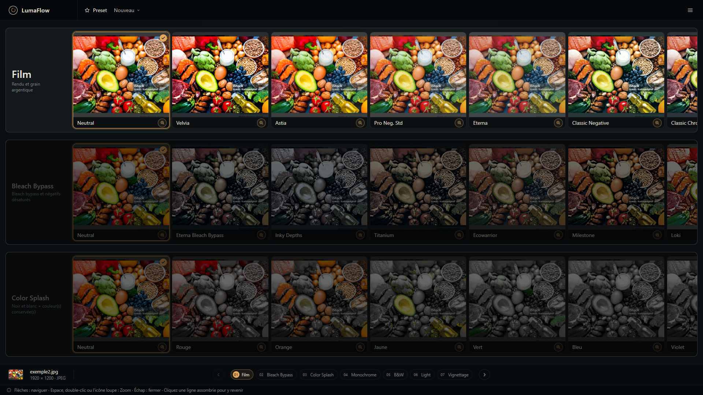

# LumaFlow

[](LICENSE)

**Votre table lumineuse, réinventée.** La retouche photo redevient un terrain de jeu.

> 📖 **Documentation complète** : **[jdjazz-75.github.io/LumaFlow](https://jdjazz-75.github.io/LumaFlow/)**
> — la version illustrée, avec captures d'écran et avant/après de chaque réglage.

---

## 1. Présentation

Posez votre photo sur la table. Faites défiler les pellicules du bout du doigt — Film, Lumière,
Vignettage — et regardez chaque style prendre vie sous vos yeux. Ce qui vous plaît, gardez-le. Ce
qui ne vous plaît pas, oubliez-le : l'original repose intact, juste en dessous, prêt à recommencer
à l'infini.



**L'esprit de la table lumineuse**

- **Zéro risque, liberté totale** — votre photo d'origine est intouchable. Testez, annulez,
  recommencez à volonté : elle ne change jamais.
- **De nouvelles pellicules arrivent, la table s'agrandit** — le tiroir de styles n'est jamais
  clos ; il s'enrichit avec le temps, sans jamais bousculer les habitudes déjà prises.
- **Tout se voit avant de se décider** — chaque étape montre son effet sous forme de vignettes, en
  un coup d'œil. Un clic applique le style ; la loupe ouvre une vue détaillée pour peaufiner chaque
  curseur.
- **Votre style, dupliqué en un clic** — une recette, mille photos. Sauvegardez vos réglages une
  fois, réutilisez-les partout.
- **Et pour mille photos, un seul geste** — le traitement par lot applique un preset à une liste
  entière d'images pendant que vous faites autre chose : progression en direct, journal détaillé,
  et un fichier en erreur n'arrête jamais les autres.

**⚡ 100 % local. 0 % cloud.** Vos photos ne quittent jamais votre ordinateur. Pas d'upload, pas de
compte, pas d'attente — tout tourne en local, dès le lancement.

→ [Page Présentation](https://jdjazz-75.github.io/LumaFlow/)

---

## 2. Installation et exécution

**Prérequis** : **Python 3.11 ou supérieur** (avec `pip`) et **Node.js** (avec `npm`, utilisé pour
construire l'interface web).

### Démarrage rapide (recommandé)

Deux scripts à la racine du dépôt installent les dépendances puis lancent le serveur en une seule
étape :

| Terminal                    | Commande                |
| --------------------------- | ----------------------- |
| PowerShell                  | `./install-and-run.ps1` |
| Invite de commandes (cmd)   | `install-and-run.bat`   |

Ils vérifient Python/Node, installent le paquet Python en mode éditable, construisent l'interface
web, puis lancent le serveur — qui ouvre automatiquement votre navigateur sur
`http://127.0.0.1:8000`. La fenêtre de terminal reste occupée tant que le serveur tourne ;
`Ctrl+C` pour l'arrêter.

### Installation manuelle

```powershell
pip install -e .
cd web
npm install
npm run build
cd ..
lumaflow
```

### Mode développement

```powershell
# Terminal 1 — API FastAPI seule (sans servir le build web)
lumaflow-api

# Terminal 2 — serveur de développement Vite (rechargement à chaud)
cd web
npm run dev
```

→ [Page Installation — détails, cas particuliers et reconstruction du front](https://jdjazz-75.github.io/LumaFlow/installation.html)

---

## 3. Fonctionnalités

- **Interface « table lumineuse »** — en haut : le logo, un sélecteur de preset et le menu ☰
  (Ouvrir/Exporter une photo, Enregistrer/Ouvrir une recette, Lot, Préférences). Au centre : la
  **pellicule**, une colonne verticale d'étapes de traitement, chacune affichant ses vignettes en
  défilement horizontal. En bas : une barre de statut (miniature et métadonnées de la source,
  pastilles de navigation, précédent/suivant) et un rappel des raccourcis clavier.
- **Application immédiate** — un simple clic sur une vignette sélectionne et applique le preset,
  sans ouvrir de vue détaillée.
- **Mode Zoom** — un grand comparateur Avant / Après avec poignée déplaçable, zoom optique et
  panoramique, et un panneau de réglages (curseurs, roues de teinte, interrupteurs) propre à
  l'étape en cours. Chaque réglage peut être réinitialisé, appliqué (aperçu) ou validé.
- **Corrections croisées Geometry / Cadrage** — depuis le Zoom de n'importe quelle étape visible,
  deux interrupteurs donnent accès à la rotation / correction de perspective et au recadrage sans
  quitter la ligne en cours d'édition.
- **Édition interactive à la souris** — directement sur l'aperçu : poignée de rotation et 4 coins
  de perspective (Geometry), poignées de cadre avec guide de composition (Cadrage), tracé
  polygonal du masque sujet/arrière-plan (Light), forme du vignettage (centre, rayons, rotation).
- **Recettes** — sauvegardez l'intégralité des réglages appliqués dans un fichier `.json` et
  réappliquez-les à une autre photo ; les incompatibilités (proportions, valeurs hors bornes,
  vignette désactivée depuis) produisent des avertissements non bloquants, jamais un échec.
  Le preset affiché dans le sélecteur d'en-tête est **automatiquement réappliqué à chaque nouvelle
  photo ouverte** : enchaîner les images d'une même série les développe toutes dans le même style,
  sans avoir à re-sélectionner quoi que ce soit. « Nouveau » revient à l'image neutre.
- **Traitement par lot** — applique une recette à   des listes entières d'images, sans en ouvrir 
  aucune. Chaque **lot** associe une sélection multiple de fichiers (mêmes formats que l'ouverture
  d'une photo, RAW compris), un preset `.json` et un dossier de sortie ; on en empile autant que 
  voulu, avec des presets et des destinations différents.
- **Photos RAW** — en plus du JPEG/PNG, LumaFlow ouvre directement les fichiers Canon (`.cr2`),
  Nikon (`.nef`) et Sony (`.arw`) : décodage et dématriçage via `rawpy`, balance des blancs
  appliquée dès le décodage, développement initial sûr, orientation EXIF respectée.
- **Préférences** — 4 onglets : Général (couleur d'accentuation, dossiers par défaut, qualité JPEG),
  Workflow (activation/réordonnancement des vignettes, import/export de `config_workflow.json`),
  Lignes (espacement, marges, opacité des lignes inactives), Vignettes (couleurs des aides de
  guidage, bornes du zoom optique).

**Raccourcis clavier** : ↑/↓ changer d'étape · ←/→ changer de vignette · Espace, double-clic ou
icône loupe pour ouvrir le Zoom · Échap pour fermer · clic sur une ligne assombrie pour y revenir.

→ [Page Fonctionnalités — captures d'écran et description complète](https://jdjazz-75.github.io/LumaFlow/fonctionnalites.html)
→ [Page Traitement par lot — le détail complet](https://jdjazz-75.github.io/LumaFlow/lot.html)

---

## 4. Workflow

Le pipeline standard est défini dans `config_workflow.json` (jamais codé en dur) et comprend
**9 étapes**. Deux d'entre elles — **Geometry** et **Cadrage** — ne s'affichent pas comme des
lignes de la pellicule mais restent éditables depuis n'importe quelle autre étape ; les 7 lignes
suivantes sont directement visibles et navigables :

| # | Étape | Rôle |
|---|---|---|
| — | **Geometry** | Rotation manuelle et correction de perspective libre à 4 coins |
| — | **Cadrage (Framing)** | Recadrage libre avec guides de composition |
| 1 | **[Film](https://jdjazz-75.github.io/LumaFlow/workflow/film.html)** | Rendu et grain argentique — moteur de gradation paramétrique partagé par les looks Fujifilm |
| 2 | **[Bleach Bypass](https://jdjazz-75.github.io/LumaFlow/workflow/bleach-bypass.html)** | Même moteur, presets de négatifs désaturés type bleach-bypass |
| 3 | **[Color Splash](https://jdjazz-75.github.io/LumaFlow/workflow/color-splash.html)** | Désature l'image sauf jusqu'à 3 plages de teinte conservées — ou **substitue** ces plages par d'autres couleurs |
| 4 | **[Monochrome](https://jdjazz-75.github.io/LumaFlow/workflow/monochrome.html)** | Duotone : supprime la couleur puis colorise la luminance avec une teinte unique |
| 5 | **[B&W](https://jdjazz-75.github.io/LumaFlow/workflow/bw.html)** | Simulations noir et blanc alternatives (filtres colorés, émulations Kodak/Ilford) |
| 6 | **[Light](https://jdjazz-75.github.io/LumaFlow/workflow/light.html)** | Exposition et contraste, courbe de tons, halo, texture, split sujet/fond par masque |
| 7 | **[Vignettage](https://jdjazz-75.github.io/LumaFlow/workflow/vignettage.html)** | Assombrissement des bords, forme éditable à l'écran |

Le détail de **chaque vignette** et de **chaque réglage manuel** de chaque ligne — avec les images
avant/après illustrant isolément la contribution de chaque curseur — n'est pas repris ici :
il vit dans la documentation HTML, dont c'est le format naturel.

→ [Détail des étapes du workflow](https://jdjazz-75.github.io/LumaFlow/workflow/index.html)

---

## Licence

Ce projet est distribué sous licence **MIT** — voir le fichier [LICENSE](LICENSE). En résumé :
usage, modification, distribution et intégration dans un projet propriétaire sont libres, à
condition de conserver la mention de copyright et la licence.


