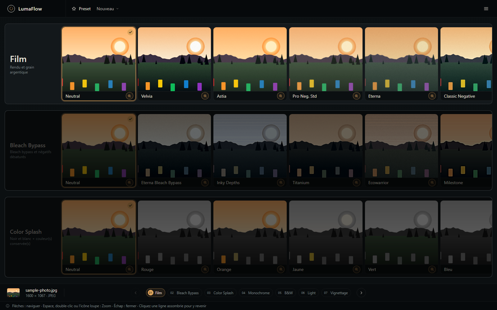
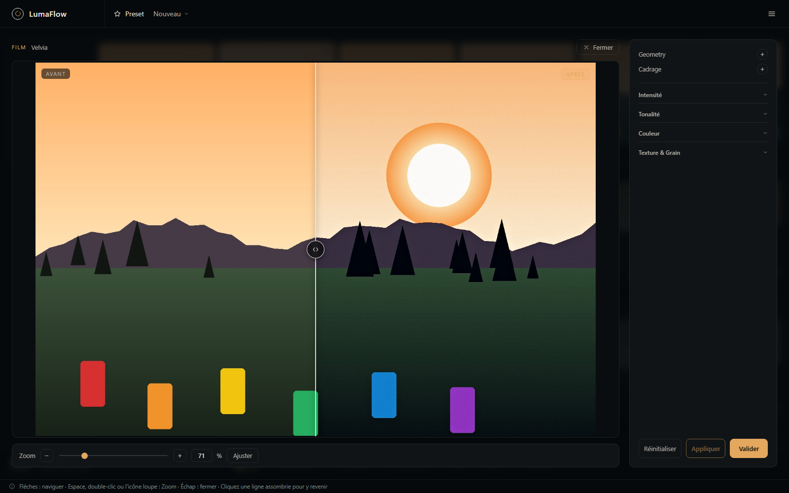
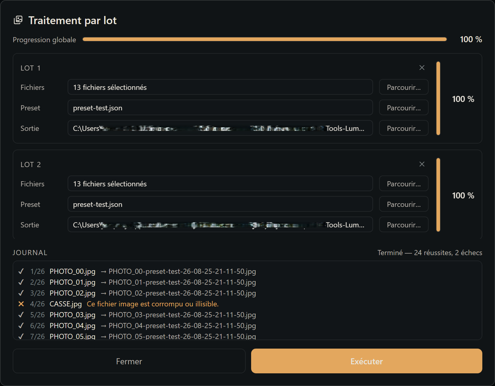

# LumaFlow Photo

### A local, non-destructive photo editor built around a visual light-table workflow.

**Explore looks. Compare them instantly. Fine-tune what you like. Keep your originals untouched.**

[](LICENSE)


<p align="center">
  
</p>

<p align="center">
  <a href="https://jdjazz-75.github.io/LumaFlow/en/">📖 Illustrated documentation (English)</a>
  ·
  <a href="https://jdjazz-75.github.io/LumaFlow/">📖 Documentation illustrée (Français)</a>
  ·
  <a href="https://github.com/jdjazz-75/LumaFlow/issues">🐛 Issues & feedback</a>
</p>

---

## What is LumaFlow?

LumaFlow reimagines photo editing as a **digital light table**.

Instead of opening panels full of controls before knowing what you want, you browse visual alternatives first: film looks, black & white treatments, lighting variations, color effects, vignettes and more.

See the result. Pick what works. Then open the detailed view only when you want to fine-tune it.

The original image is never modified.

**No cloud. No account. No upload. Your photos stay on your computer.**

---

## Why LumaFlow?

### 🎞 Visual-first editing

Each processing step is presented as a horizontal strip of visual alternatives.

You can compare different interpretations of your image before touching a slider.

### 🔍 Before / after editing

Open any step in the Zoom view to get a large before/after comparator, optical zoom, panning and detailed controls.

### 🧪 Non-destructive workflow

Experiment freely.

Your source image remains untouched, so you can try, undo and rebuild a look without risking the original.

### 📷 RAW support

LumaFlow can open common camera RAW formats directly:

- Canon `.cr2`
- Nikon `.nef`
- Sony `.arw`

RAW decoding and demosaicing are handled locally.

### 🧾 Reusable recipes

Save an entire editing configuration as a `.json` recipe and apply it to another image.

This makes it easy to keep a consistent look across a complete photo series.

### ⚡ Batch processing

Apply a recipe to a whole list of images without opening them individually.

Each batch can use its own:

- source files;
- recipe;
- destination folder.

A failed image does not stop the rest of the batch.

### 🔒 Local by design

LumaFlow runs entirely on your machine.

```text
Your photo
    ↓
LumaFlow on your computer
    ↓
Your exported photo

No cloud upload.
No online account.
No remote processing.
```

---

## See it in action

### Light-table interface

Browse processing steps and visual presets directly from the main interface.

### Film strip workflow

<p align="center">
  
</p>

Each step exposes its available looks as a scrollable strip.

### Detailed editing

<p align="center">
  
</p>

Use the Zoom view for before/after comparison and detailed adjustments.

➡️ See the full illustrated documentation: [English](https://jdjazz-75.github.io/LumaFlow/en/) · [Français](https://jdjazz-75.github.io/LumaFlow/)

---

## Editing workflow

The standard LumaFlow pipeline contains nine processing stages.

| Stage | Purpose |
|---|---|
| **Geometry** | Manual rotation and free four-corner perspective correction |
| **Framing** | Free cropping with composition guides |
| **Film** | Film rendering and grain |
| **Bleach Bypass** | Desaturated negative / bleach-bypass looks |
| **Color Splash** | Preserve or replace selected color ranges |
| **Monochrome** | Single-hue luminance colorization |
| **B&W** | Black & white simulations and color-filter effects |
| **Light** | Exposure, contrast, tone curve, glow, texture and subject/background adjustments |
| **Vignette** | Interactive edge darkening and vignette geometry |

The workflow is configurable rather than hard-coded, so stages can evolve without redesigning the application around them.

➡️ Explore every processing stage: [English](https://jdjazz-75.github.io/LumaFlow/en/workflow/) · [Français](https://jdjazz-75.github.io/LumaFlow/workflow/)

---

## Quick start

### Requirements

You currently need:

- **Python 3.11+**
- `pip`
- **Node.js**
- `npm`

Clone the repository:

```bash
git clone https://github.com/jdjazz-75/LumaFlow.git
cd LumaFlow
```

### Windows — easiest way

Two launch scripts are provided at the root of the repository.

With PowerShell:

```powershell
./install-and-run.ps1
```

Or with Command Prompt:

```cmd
install-and-run.bat
```

The script checks the required tools, installs the Python package, builds the web interface and starts LumaFlow.

Your browser should then open:

```text
http://127.0.0.1:8000
```

Press `Ctrl+C` in the terminal to stop the application.

---

## Manual installation

Install the Python package:

```bash
pip install -e .
```

Build the frontend:

```bash
cd web
npm install
npm run build
cd ..
```

Start LumaFlow:

```bash
lumaflow
```

Then open:

```text
http://127.0.0.1:8000
```

➡️ Detailed installation guide: [English](https://jdjazz-75.github.io/LumaFlow/en/installation.html) · [Français](https://jdjazz-75.github.io/LumaFlow/installation.html)

---

## Development mode

Run the FastAPI backend:

```bash
lumaflow-api
```

In another terminal, start the Vite development server:

```bash
cd web
npm run dev
```

This gives you frontend hot reload while keeping the API running separately.

---

## Keyboard navigation

LumaFlow is designed to be browsable quickly from the keyboard.

| Key | Action |
|---|---|
| `↑` / `↓` | Previous / next processing stage |
| `←` / `→` | Previous / next visual preset |
| `Space` | Open detailed Zoom view |
| Double click | Open detailed Zoom view |
| `Esc` | Close detailed view |

---

## Recipes and batch workflows

Once you have created a look you like, save it as a recipe.

A recipe captures the editing configuration so it can be reused on another photograph or applied to a whole series.

For larger collections, Batch mode lets you queue several groups of images with different recipes and output destinations.

<p align="center">
  
</p>

➡️ Batch processing documentation: [English](https://jdjazz-75.github.io/LumaFlow/en/batch.html) · [Français](https://jdjazz-75.github.io/LumaFlow/lot.html)

---

## Documentation

The complete illustrated documentation contains screenshots, detailed explanations and before/after examples for individual settings, available in **English** and **French**.

**📖 English: https://jdjazz-75.github.io/LumaFlow/en/**
**📖 Français : https://jdjazz-75.github.io/LumaFlow/**

Useful sections:

| Section | English | Français |
|---|---|---|
| Overview | [Overview](https://jdjazz-75.github.io/LumaFlow/en/) | [Présentation](https://jdjazz-75.github.io/LumaFlow/) |
| Installation | [Installation](https://jdjazz-75.github.io/LumaFlow/en/installation.html) | [Installation](https://jdjazz-75.github.io/LumaFlow/installation.html) |
| Features | [Features](https://jdjazz-75.github.io/LumaFlow/en/features.html) | [Fonctionnalités](https://jdjazz-75.github.io/LumaFlow/fonctionnalites.html) |
| Batch processing | [Batch processing](https://jdjazz-75.github.io/LumaFlow/en/batch.html) | [Traitement par lot](https://jdjazz-75.github.io/LumaFlow/lot.html) |
| Workflow details | [Workflow](https://jdjazz-75.github.io/LumaFlow/en/workflow/) | [Workflow](https://jdjazz-75.github.io/LumaFlow/workflow/) |

---

## Project status

LumaFlow is still evolving.

The current goal is to explore a different approach to photo editing: **make visual exploration the starting point of the workflow rather than the final step.**

Feedback is especially useful around:

- usability and workflow;
- RAW compatibility;
- film and photographic looks;
- performance;
- batch processing;
- missing editing tools;
- Windows, Linux and macOS compatibility.

Found a bug or have an idea?

➡️ [Open an issue](https://github.com/jdjazz-75/LumaFlow/issues)

---

## Contributing

Contributions, bug reports and ideas are welcome.

If you want to contribute:

1. Fork the repository.
2. Create a branch for your change.
3. Test your changes.
4. Open a pull request explaining what you changed and why.

Even if you don't write code, feedback from photographers is valuable.

---

## License

LumaFlow is distributed under the **MIT License**.

You are free to use, modify and distribute the project subject to the terms of the [LICENSE](LICENSE) file.

---

## Support the project

If you find LumaFlow interesting, **⭐ starring the repository helps other photographers and developers discover it.**

And if you try it, feedback is even more useful:

👉 [github.com/jdjazz-75/LumaFlow/issues](https://github.com/jdjazz-75/LumaFlow/issues)